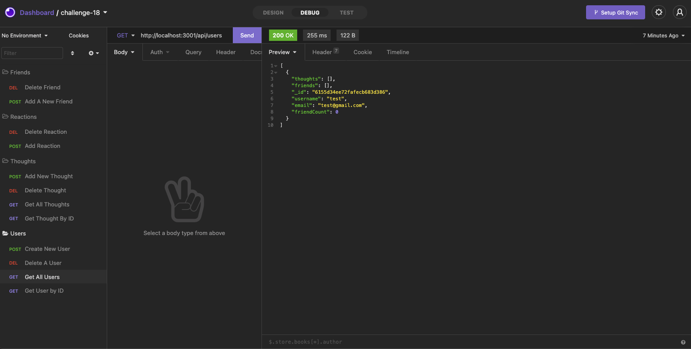
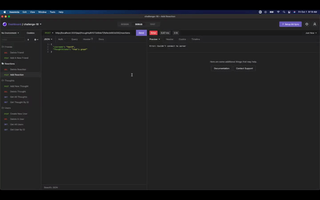

# Project Title
Challenge 18 


# Description
This project built an API for a social network web application where users can share their thoughts, react to friends’ thoughts, and create a friend list. It uses Express.js for routing, a MongoDB database, and the Mongoose ODM. To explore this api, use insomnia or a similar software:



Follow this [link](https://github.com/abergtra/challenge-18) for the GitHub repository.

# Table of Contents 
* [Installation](#-Installation)
* [Usage](#-Usage)
* [License](#-Installation)
* [Contributing](#-Contributing)
* [Tests](#-Tests)
* [Questions](#-Questions)
    
# Installation
Step #1: Run `npm install` in your command line. Ensure all required libraries are installed (express, sequelize, mysql2, etc).

Step #2: Run `npm start` in your command line.

Step #3: Open Insomnia and explor the various actions you can take!

# Usage
Explore the back end product's functionality in insomnia by executing the actions shown in the following walkthroughs:

## Users:
```bash
- Create New User
- Delete a User
- Get All Users
- Get User By ID
```


A video walkthrough is also available if you follow this [link](https://youtu.be/v-NW6WWG8fc).

## Thoughts:
```bash
- Add New Thought
- Delete Thought
- Get All Thoughts
- Get Thought By ID
```


A video walkthrough is also available if you follow this [link](https://youtu.be/v-NW6WWG8fc).

## Reactions:
```bash
- Delete a Reaction
- Add A Reaction
```



A video walkthrough is also available if you follow this [link](https://youtu.be/v-NW6WWG8fc).

## Friends:
```bash
- Delete a Friend
- Add A New Friend
```


A video walkthrough is also available if you follow this [link](https://youtu.be/v-NW6WWG8fc).

# License 
[License: MIT](https://opensource.org/licenses/MIT) 
* As this list provided is not comprehensive, if you need another license, contact the author for additional options. 


# Contributing 
Please contact the author about contributing.

# Tests
There are no tests available for this application.

# Questions
* GitHub Username: abergtra
* Contact Email: asher.bergtraun@gmail.com